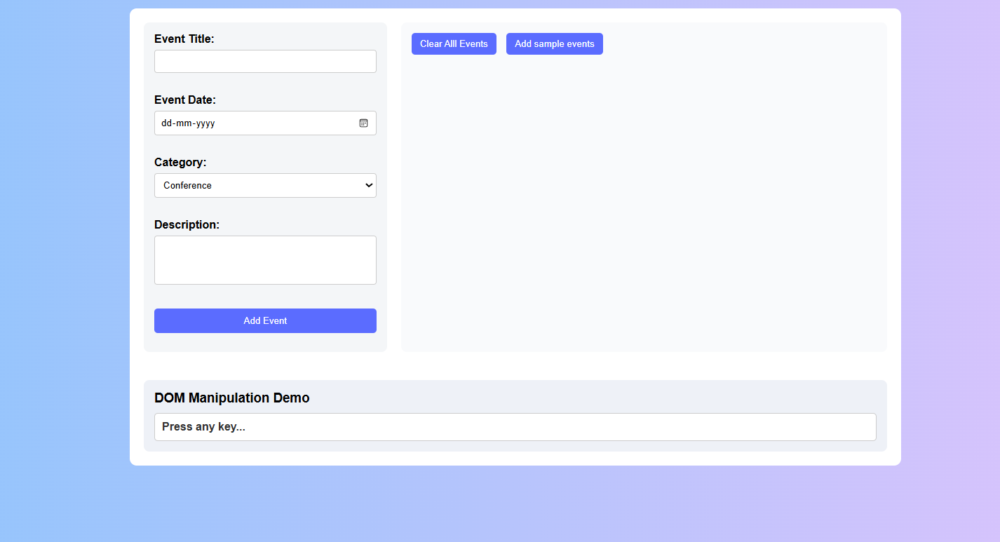

# web-dev-sem-2-assignment-1

# Smart Event Dashboard
# Project Description

Smart Event Dashboard ek simple web-based application hai jisme users events add, display aur manage kar sakte hain.
Yeh project HTML, CSS aur Vanilla JavaScript ka use karke banaya gaya hai without any external libraries or frameworks.

Is project ka main focus hai:

DOM Manipulation

Event Handling

Dynamic Element Creation

Clean UI using CSS

# Features
1️ Add Event

User form ke through event add kar sakta hai.

Event Title, Date, Category aur Description input liya jata hai.

Event dynamically card format me display hota hai.

2️ Delete Single Event

Har event card me delete (x) option diya gaya hai.

Click karne par specific event remove ho jata hai.

3️ Clear All Events

“Clear All Events” button se saare events ek saath remove ho jate hain.

4️ Add Sample Events

Predefined sample events automatically load kiye ja sakte hain demo ke liye.

5️ DOM Manipulation Demo

Keyboard key press karne par screen par “You pressed: (key)” display hota hai.

Isme keydown event aur innerText ka use kiya gaya hai.

# Technologies Used

HTML5

CSS3

JavaScript (Vanilla JS)

DOM Manipulation

Event Listeners

# Concepts Implemented

querySelector() and querySelectorAll()

addEventListener()

createElement()

innerHTML and innerText

forEach()

Dynamic DOM updates

Keyboard events (keydown)

# Project Structure
Smart-Event-Dashboard/
│
├── index.html
├── style.css
├── script.js
└── README.md

# How to Run

Download or clone the project.

Open index.html in any browser.

Start adding and managing events.

# Learning Outcome

Is project ke through maine:

DOM manipulation samjha

Event handling implement kiya

Dynamic UI generation seekha

JavaScript aur HTML integration practice ki

# Here are some screenshot of the outcome:-

# Author
Yash Verma
